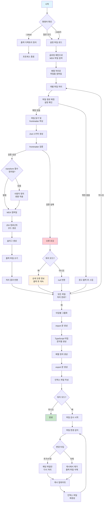

## 왜 커스텀 MDX 컴파일러가 필요했을까?

블로그의 콘텐츠 관리는 텍스트 기반의 단순함과 유연성이 장점인 마크다운으로 하기로 했습니다. 여기에 JSX를 결합한 MDX는 필요에 따라 콘텐츠 내부에 리액트 컴포넌트를 직접 포함할 수 있어서, 문서의 표현력과 재사용성이 크게 향상됩니다.

하지만 MDX를 실제 프로젝트 워크플로에 통합할 때는 몇 가지 설계 선택이 필요합니다. 예를 들어, Next.js의 공식/일반적인 MDX 통합(`@next/mdx`)은 빠르고 간편하게 페이지에 MDX를 넣을 수 있게 해주지만, 파이프라인 전체(메타데이터 검증, 커스텀 변환, 출력물 형태 제어, 인덱스 생성 등)를 세밀하게 제어하기에는 한계가 있습니다. 반면 Contentlayer2나 Velite 같은 도구는 로컬 파일을 애플리케이션 데이터로 변환하는 데 강력한 기능(빌트인 인덱싱, 타입 지원, 다양한 플러그인 등)을 제공하지만, 그만큼 구조가 크고 설계 결정이 강제되며 초기 학습 비용과 설정 복잡도가 있습니다.

이 프로젝트의 주된 동기는 '학습'이었고, 파이프라인을 직접 제어해 확장성과 검증을 모두 경험해보고자 했습니다. 이 목표를 달성하려면 도구의 내부 동작을 직접 제어할 수 있어야 했습니다. 따라서 기존 솔루션을 그대로 쓰기보다는 MDX 에코시스템(remark/rehype, @mdx-js/mdx 등)을 활용하되, 우리가 원하는 검증·변환·출력 흐름을 직접 구현하는 쪽을 선택했습니다. 이 방식은 초기에는 구현 비용과 유지보수 부담이 늘어나지만, 동시에 파이프라인 전반을 완전히 이해하고 필요에 따라 언제든 확장하거나 최적화할 수 있는 장점을 제공합니다.

## 요구사항

`@codoodle/mdx` 는 다음과 같은 요구사항을 충족하고자 했습니다.

**설정 및 구성**

- 설정 파일을 통해 콘텐츠 타입, frontmatter 스키마, 출력 경로 등을 설정할 수 있습니다.
- 글로빙 패턴을 사용해 다양한 디렉토리(파일 경로) 구조의 MDX 파일을 처리합니다.

**콘텐츠 처리**

- 런타임 타입 검증으로 frontmatter의 타입 안전성을 보장합니다.
- 파일 경로를 기반으로 자동으로 URL 슬러그를 생성합니다.
- 사용자가 콘텐츠와 메타데이터를 커스텀 처리할 수 있도록 추가 변환 기능을 제공합니다.

**컴파일 및 변환**

- MDX를 JSX 컴포넌트로 컴파일하여 React에서 바로 사용할 수 있습니다.
- 타입 안전한 인덱스 파일을 생성해 편리한 `import`를 지원합니다.

**개발 경험**

- 파일 감시 및 증분 빌드로 개발 중 빠른 피드백을 제공합니다.
- 명령줄 인터페이스(`CLI`)를 제공합니다.
- frontmatter 검증 오류와 파일 처리 오류에 대한 상세한 디버깅 정보를 제공합니다.

## 개발 과정

### 전체 작업 흐름

`@codoodle/mdx`의 전체 작업 흐름을 도식으로 나타내면 다음과 같습니다.



### 기술 스택

다음과 같은 라이브러리들을 활용해 `@codoodle/mdx`를 구현했습니다.

| 라이브러리        | 역할             | 특징                                                                       |
| ----------------- | ---------------- | -------------------------------------------------------------------------- |
| **`@mdx-js/mdx`** | MDX 컴파일       | Remark/Rehype 기반, `outputFormat: "function-body"`로 유연한 컴포넌트 생성 |
| **`chokidar`**    | 파일 감시        | 크로스 플랫폼 파일 시스템 이벤트 감시, 워치 모드 구현                      |
| **`globby`**      | 파일 매칭        | fast-glob 기반 글로빙 패턴으로 콘텐츠 파일 검색                            |
| **`gray-matter`** | frontmatter 파싱 | YAML/JSON/TOML 지원, 메타데이터 추출                                       |
| **`js-yaml`**     | 엄격한 YAML 검증 | `JSON_SCHEMA`로 JSON 호환 YAML만 허용                                      |
| **`p-map`**       | 병렬 처리        | 동적 concurrency (CPU 코어 x 2, 최대 12), I/O 최적화                       |
| **`picomatch`**   | 패턴 매칭        | 고성능 글로빙 매칭, 설정 파일 패턴 검증                                    |
| **`zod`**         | 타입 검증        | 런타임 타입 안전성, 상세한 검증 오류 메시지                                |

### 설정 파일

실행하는 프로젝트 루트에 `codoodle.config.js` 파일을 사용한 설정을 지원합니다. 이 설정 파일을 통해 프로젝트는 다양한 콘텐츠 타입(예: 블로그 포스트, 카테고리)을 정의하고, 각 타입별 frontmatter 스키마로 메타데이터 구조를 지정할 수 있습니다. 필요에 따라 Remark/Rehype 플러그인을 통해 MDX 마크다운을 확장하거나, 병렬 처리 등 성능 관련 옵션을 조정해 빌드 성능을 튜닝할 수 있습니다.

```js title="app/www/codoodle.config.js"
/**
 * @type {import("@codoodle/mdx").MdxConfig}
 */
export default {
  content: {
    "blog/**/*.md{,x}": {
      name: "Post",
      output: "blog/posts",
      frontmatter: {
        title: {
          type: "string",
          required: true,
        },
        description: {
          type: "string",
        },
        // ... 필드 정의
      },
    },
    // ... 콘텐츠 타입 정의
  },
  contentCompileOptions: {
    jsx: true,
    remarkPlugins: [], // 필요시 remark 플러그인 추가
    rehypePlugins: [], // 필요시 rehype 플러그인 추가
    ...
  },
  concurrency: 8, // 필요시 기본값 대신 커스텀 concurrency 지정
};
```

### Frontmatter 검증

설정 파일에 선언된 각 콘텐츠 타입에 따라 Zod 스키마를 생성하고, 이 스키마를 활용해 런타임에 타입을 검증합니다.

```ts
function createZodSchema(
  frontmatter?: Record<string, FrontmatterField>,
): ZodType {
  if (!frontmatter) {
    return z.object({});
  }

  const shape: Record<string, ZodType> = {};

  for (const [key, field] of Object.entries(frontmatter)) {
    let zodType: ZodType;

    // 필드 타입에 따라 Zod 스키마 생성
    switch (field.type) {
      case "string":
        zodType = z.string();
        break;
      case "date":
        zodType = z.iso.datetime(); // ISO 8601 날짜 형식 검증
        break;
      case "number":
        zodType = z.number();
        break;
      case "boolean":
        zodType = z.boolean();
        break;
      case "array":
        zodType = z.array(createZodSchema(field.fields)); // 재귀적 스키마 생성
        break;
      case "object":
        zodType = createZodSchema(field.fields); // 재귀적 스키마 생성
        break;
      default:
        zodType = z.any();
    }

    // 필수 필드가 아니면 optional로 설정
    if (!field.required) {
      zodType = zodType.optional();
    }

    shape[key] = zodType;
  }

  return z.object(shape);
}
```

### MDX 컴파일레이션

`@mdx-js/mdx`의 `compile` 함수를 사용해 MDX 콘텐츠를 JSX 컴포넌트로 변환합니다.

```ts
async function processSingleFile(
  filePath: string,
  sourceDir: string,
): Promise<ProcessedContent | null> {
  try {
    // 1) 입력 파일의 소스 기준 상대 경로 계산
    const relativeFilePath = relative(sourceDir, filePath);

    // 2) 설정 파일(config)에서 이 파일에 매칭되는 콘텐츠 설정 찾기
    const contentConfig = findMatchingContentConfig(relativeFilePath);
    if (!contentConfig) {
      // 매칭되는 설정이 없으면 처리 안 함
      console.warn(`[${relativeFilePath}] No matching config found.`);
      return null;
    }

    // 3) 원본 파일 읽기 및 frontmatter + 본문 분리 (gray-matter 사용)
    const rawContent = (await readFile(filePath, "utf-8")).trim();
    const { data, content } = matter(rawContent, { ... });

    // 4) frontmatter 스키마 생성 및 검증 (Zod)
    const validationSchema = createZodSchema(contentConfig.frontmatter);
    let parsedFrontmatter = validationSchema.parse(data);

    // 5) (선택) 사용자 정의 변환 함수 적용: metadata 및 content 수정 가능
    let contentToProcess = content;
    if (contentConfig.transform) {
      const transformedResult = await contentConfig.transform({
        content,
        metadata: parsedFrontmatter as Record<string, unknown>,
        filePath,
      });
      parsedFrontmatter = transformedResult.metadata;
      contentToProcess = transformedResult.content;
    }

    // 6) MDX 컴파일 (MDX -> JSX/함수 바디)
    const compiledMdx = contentToProcess
      ? await compile(contentToProcess, compileOptions)
      : undefined;

    // 7) 컴파일 결과와 frontmatter를 바탕으로 출력용 코드(생성 파일) 문자열 생성
    const generatedCode = `/* ...generated code including frontmatter and ContentComponent... */`;

    // 8) 출력 파일 경로(슬러그 기반) 계산 및 디렉토리 생성
    const contentSlug = relativeFilePath
      .replace(/\.[^/.]+$/, "")
      .replace(/\/index$/, "")
      .replace(/^\//, "");
    const outputFilePath = resolve(outputDirectory, contentConfig.output, `${...}.jsx`);
    await ensureDirectoryExists(dirname(outputFilePath));

    // 9) 파일 쓰기
    await writeFile(outputFilePath, generatedCode, "utf-8");

    // 10) 처리 결과 객체 생성 및 반환
    const processedItem: ProcessedContent = {
      type: contentConfig.name,
      filePath,
      relativePath: relativeFilePath,
      slug: contentSlug,
      frontmatter: parsedFrontmatter as Record<string, unknown>,
      outFilePath: outputFilePath,
    };

    console.log(`✅ Processed: ${relativeFilePath} → ${relative(outputDirectory, outputFilePath)}`);
    return processedItem;
  } catch (error) {
    // 오류 로깅 및 워치 모드에서 상세 에러(예: Zod validation issues) 출력
    const errorMessage = error instanceof Error ? error.message : String(error);
    console.warn(`❌ Failed to process ${relative(sourceDir, filePath)}: ${errorMessage}`);

    if (isWatchMode) {
      console.warn(`   → File path: ${filePath}`);
      if (error instanceof z.ZodError) {
        console.warn(`   → Validation errors:`, error.issues);
      }
    }
    return null;
  }
}
```

### 인덱스 파일 생성

생성된 콘텐츠를 타입 안전한 인덱스 파일로 묶어 `import`하기 쉽게 만듭니다. 이 인덱스 파일은 각 콘텐츠 타입별로 배열을 내보내며, 기본 내보내기(`default export`)로 모든 타입을 포함하는 객체를 제공합니다.

```ts
async function generateIndexFile(processedContents: ProcessedContent[]) {
  // 1) 정렬: type, then slug
  const sortedContents = processedContents.sort((a, b) => {
    if (a.type !== b.type) {
      return a.type.localeCompare(b.type);
    }
    return a.slug.localeCompare(b.slug);
  });

  // 2) 타입별 그룹화 (Map<string, ProcessedContent[]>)
  const contentsByType = new Map<string, ProcessedContent[]>();
  for (const contentItem of sortedContents) {
    if (!contentsByType.has(contentItem.type)) {
      contentsByType.set(contentItem.type, []);
    }
    contentsByType.get(contentItem.type)!.push(contentItem);
  }

  // 3) index 파일에 쓸 import/변수 이름 준비
  const imports: string[] = [];
  const variableNames = new Map<ProcessedContent, string>();
  const indexFileDir = dirname(indexFile);

  for (const contentItem of sortedContents) {
    // variableName은 `${type}_${slug}` 형태로 생성하고, 안전한 식별자로 변환
    const componentVariableName =
      `${contentItem.type}_${contentItem.slug}`.replace(/[^a-zA-Z0-9]/g, "_");

    // index 파일에서 import 할 상대 경로(.jsx 확장자 제거)
    const relativeImportPath = `./${relative(indexFileDir, contentItem.outFilePath).replace(/\.jsx$/, "")}`;

    // import 문 추가
    imports.push(
      `import ${componentVariableName} from "${relativeImportPath}";`,
    );

    // 나중에 참조를 위해 map에 저장
    variableNames.set(contentItem, componentVariableName);
  }

  // 4) 타입별로 배열(=파일에 정의될 const 배열)과 exports 준비
  const contentTypeExports = new Map<string, string>();
  const exports: string[] = [];

  for (const [contentTypeName, contentItems] of contentsByType) {
    // 각 contentItem을 참조하는 객체 리터럴 문자열을 생성(생성되는 항목 내부는 생략)
    const itemExports = contentItems
      .map((contentItem) => {
        const componentVariableName = variableNames.get(contentItem)!;
        return `  {
    ...${componentVariableName},
    slug: "${contentItem.slug}",
  },`;
      })
      .join("\n");

    contentTypeExports.set(contentTypeName, itemExports);
    // default export 객체 키로 사용될 라인 준비
    exports.push(
      `  ${contentTypeName.toLowerCase()}: ${contentTypeName}Array,`,
    );
  }

  // 5) 실제 파일에 들어갈 배열 정의 및 export 문 조립
  const arrayDefinitions: string[] = [];
  for (const [contentTypeName, exportContent] of contentTypeExports) {
    const arrayVariableName = `${contentTypeName}Array`;
    arrayDefinitions.push(`const ${arrayVariableName} = [
${exportContent}
] as (${frontmatterType} & {
  ContentComponent?: (props?: Record<string, unknown>) => React.JSX.Element;
} & { slug: string })[];`);
  }

  const multipleExports: string[] = [];
  for (const contentTypeName of contentsByType.keys()) {
    const arrayVariableName = `${contentTypeName}Array`;
    multipleExports.push(
      `export const ${contentTypeName.toLowerCase()} = ${arrayVariableName};`,
    );
  }

  // 6) index 파일 문자열 완성 (imports, 배열 정의, 개별 exports, default export)
  const indexContent = `/* Auto-generated file - do not edit directly */

${imports.join("\n")}

${arrayDefinitions.join("\n\n")}

${multipleExports.join("\n")}

export default {
${exports.join("\n")}
};
`;

  // 7) 파일 쓰기 및 로그
  await writeFile(indexFile, indexContent, "utf-8");

  const totalFiles = processedContents.length;
  const totalTypes = contentsByType.size;

  console.log(
    `\n✅ Generated index file: ${relative(process.cwd(), indexFile)}`,
  );
  console.log(`📊 Summary: ${totalFiles} files, ${totalTypes} content types`);
  for (const [contentTypeName, contentItems] of contentsByType) {
    console.log(`   ${contentTypeName}: ${contentItems.length} files`);
  }
}
```

### TypeScript 타입 안전성

`@codoodle/mdx`의 핵심 기능 중 하나는 frontmatter 스키마에서 자동으로 TypeScript 타입을 생성하는 것입니다. 이를 통해 컴파일 시점과 런타임 모두에서 타입 안전성을 보장합니다.

```ts
function createTypeScriptType(
  frontmatter?: Record<string, FrontmatterField>,
): string {
  if (!frontmatter) {
    return "{}";
  }

  const fields: string[] = [];

  for (const [key, field] of Object.entries(frontmatter)) {
    let typeStr: string;

    switch (field.type) {
      case "string":
        typeStr = "string";
        break;
      case "date":
        typeStr = "string"; // ISO 8601 문자열
        break;
      case "number":
        typeStr = "number";
        break;
      case "boolean":
        typeStr = "boolean";
        break;
      case "array": {
        const arrayType = createTypeScriptType(field.fields);
        typeStr = `${arrayType}[]`;
        break;
      }
      case "object":
        typeStr = createTypeScriptType(field.fields);
        break;
      default:
        typeStr = "unknown";
    }

    const optional = field.required ? "" : "?";
    fields.push(`  ${key}${optional}: ${typeStr};`);
  }

  return `{\n${fields.join("\n")}\n}`;
}
```

생성되는 배열은 다음과 같은 타입 정보를 포함합니다:

```ts
const DocumentArray = [
  {
    ...Document_docs_getting_started,
    slug: "docs/getting-started",
  },
  {
    ...Document_docs_new_doc,
    slug: "docs/new-doc",
  },
] as ({
  title?: string;
  description?: string;
} & {
  ContentComponent: (props?: Record<string, unknown>) => React.JSX.Element;
} & { slug: string })[];
```

이를 통해 IDE에서 자동완성과 타입 체크를 받을 수 있으며, 실수로 잘못된 속성에 접근하는 것을 방지할 수 있습니다.

### 워치 모드 및 증분 빌드

개발 중 파일 변경에 즉각 반응하는 워치 모드를 지원합니다.

#### 캐시 기반 증분 처리

파일이 변경되었을 때, 변경된 파일만 다시 처리하도록 캐시를 활용해 증분 빌드를 구현해 빌드 시간을 단축할 수 있습니다.

```ts
const processedContentsCache: Map<string, ProcessedContent> = new Map();

async function updateCacheAndIndex(
  filePath: string,
  operation: "add" | "update" | "remove",
) {
  const normalizedPath = resolve(filePath);

  if (operation === "remove") {
    // 캐시에서 제거하고 출력 파일 삭제
    const existingEntry = Array.from(processedContentsCache.values()).find(
      (content) => resolve(content.filePath) === normalizedPath,
    );
    if (existingEntry) {
      processedContentsCache.delete(existingEntry.filePath);

      try {
        await rm(existingEntry.outFilePath, { force: true });
        console.log(
          `🗑️  Removed output file: ${relative(outputDirectory, existingEntry.outFilePath)}`,
        );
      } catch {
        // 파일이 없으면 무시
      }
    }
  } else {
    // 변경된 파일만 다시 처리
    const processedContent = await processSingleFile(filePath, sourceDirectory);
    if (processedContent) {
      processedContentsCache.set(processedContent.filePath, processedContent);
    }
  }

  const allContents = Array.from(processedContentsCache.values());
  await generateIndexFile(allContents);
}
```

#### Chokidar 파일 감시 설정

`chokidar`를 사용해 파일 시스템 이벤트를 감시하고, 변경된 파일만 다시 처리합니다.

```ts
// 파일 감시 설정
const watcher = chokidar.watch(".", {
  cwd: sourceDirectory,
  ignored: (path, stats) =>
    !!stats?.isFile() && !path.endsWith(".md") && !path.endsWith(".mdx"),
  ignoreInitial: true,
  persistent: true,
});

// 파일 변경 시 처리
watcher.on("change", async (changedFile) => {
  console.log(`\n🔄 File changed: ${changedFile}`);
  const fullPath = resolve(sourceDirectory, changedFile);

  console.log("🔨 Updating index...");
  await updateCacheAndIndex(fullPath, "update");
  console.log("✅ Index updated");
});

// 파일 추가 시 처리
watcher.on("add", async (addedFile) => {
  console.log(`\n➕ File added: ${addedFile}`);
  const fullPath = resolve(sourceDirectory, addedFile);

  console.log("🔨 Updating index...");
  await updateCacheAndIndex(fullPath, "add");
  console.log("✅ Index updated");
});

// 파일 삭제 시 처리
watcher.on("unlink", async (removedFile) => {
  console.log(`\n🗑️  File removed: ${removedFile}`);
  const fullPath = resolve(sourceDirectory, removedFile);

  console.log("🔨 Updating index...");
  await updateCacheAndIndex(fullPath, "remove");
  console.log("✅ Index updated");
});

// Graceful shutdown 처리
const gracefulShutdown = async (signal: string) => {
  console.log(`\n🛑 Received ${signal}, stopping watch mode...`);
  await watcher.close();
  process.exit(0);
};

process.on("SIGINT", () => gracefulShutdown("SIGINT"));
process.on("SIGTERM", () => gracefulShutdown("SIGTERM"));
```

### 성능 최적화

#### 동적 동시성 제어

CPU 코어 수에 따라 동적으로 동시성을 조절해 최적의 성능을 달성합니다.

```ts
const CONCURRENCY_CONFIG = {
  MIN: 2,
  MAX: 12,
  CPU_MULTIPLIER: 2,
} as const;

function calculateOptimalConcurrency(): number {
  const cpuCount = cpus().length;
  const calculated = cpuCount * CONCURRENCY_CONFIG.CPU_MULTIPLIER;
  return Math.min(
    Math.max(calculated, CONCURRENCY_CONFIG.MIN),
    CONCURRENCY_CONFIG.MAX,
  );
}
```

#### 디렉토리 생성 캐싱

워치 모드에서 반복적인 디렉토리 생성을 방지해 I/O 최적화를 구현합니다.

```ts
const createdDirectories = new Set<string>();

async function ensureDirectoryExists(dirPath: string) {
  if (isWatchMode && createdDirectories.has(dirPath)) {
    return; // 이미 생성된 디렉토리는 스킵
  }

  await mkdir(dirPath, { recursive: true });

  if (isWatchMode) {
    createdDirectories.add(dirPath);
  }
}
```

#### 처리 결과 캐싱

파일별 처리 결과를 캐싱해 워치 모드에서 변경된 파일만 다시 처리합니다.

```ts
const processedContentsCache: Map<string, ProcessedContent> = new Map();
```

이러한 최적화를 통해 대규모 콘텐츠에서도 빠른 빌드 성능을 유지할 수 있습니다.

## 사용법 및 예시

### 명령줄 인터페이스

다음과 같이 간단한 CLI를 제공합니다.

```bash
# 일반 빌드
pnpm mdx ./content

# 워치 모드 (개발 중)
pnpm mdx ./content --watch

# 출력 디렉토리 정리
pnpm mdx ./content --clean
```

### 실제 사용 예시

설정 파일을 만듭니다.

```js title="codoodle.config.js"
/**
 * @type {import("@codoodle/mdx").MdxConfig}
 */
export default {
  content: {
    "docs/**/*.md{,x}": {
      name: "Document",
      output: "docs",
      frontmatter: {
        title: {
          type: "string",
        },
        description: {
          type: "string",
        },
      },
    },
  },
  contentCompileOptions: {
    jsx: true,
  },
};
```

MDX 파일을 작성합니다.

```mdx title="content/docs/getting-started.mdx"
---
title: "시작하기"
description: "MDX 컴파일러 사용법"
---

# 시작하기

이것은 **MDX** 파일입니다. 마크다운과 JSX를 함께 사용할 수 있습니다.

<div style={{ padding: "1rem", background: "#f0f0f0" }}>
  커스텀 JSX 컴포넌트도 사용 가능합니다!
</div>
```

MDX 컴파일러를 실행합니다.

```bash
pnpm mdx ./content
```

컴파일된 파일과 인덱스 파일이 생성됩니다.

```plain title="/.codoodle-mdx"
├── docs/
│   └── docs_getting-started.jsx
└── index.ts
```

```ts title="/.codoodle-mdx/index.ts"
import Document_docs_getting_started from "./docs/docs_getting-started";

const DocumentArray = [
  {
    ...Document_docs_getting_started,
    slug: "docs/getting-started",
  },
] as ({
  title?: string;
  description?: string;
} & {
  ContentComponent: (props?: Record<string, unknown>) => React.JSX.Element;
} & { slug: string })[];

export const document = DocumentArray;

export default {
  document: DocumentArray,
};
```

컴파일된 콘텐츠는 Next.js에서 직접 import하여 사용할 수 있습니다.

```tsx title="app/www/app/page.tsx"
import { document as documents } from ".codoodle-mdx";

export default function Home() {
  return (
    <div>
      {documents.map((doc) => (
        <div key={doc.slug}>
          <h2>{doc.title ?? "Untitled Document"}</h2>
          <p>{doc.description ?? "No description available."}</p>
          <doc.ContentComponent />
        </div>
      ))}
    </div>
  );
}
```

#### 개발 워크플로우

```bash
# 개발 시작
pnpm mdx ./content --watch &
pnpm dev

# 새 문서 작성
echo "# 새 문서" > content/docs/new-doc.mdx
# 자동으로 컴파일되어 브라우저에서 확인 가능

# 빌드 시
pnpm mdx ./content
pnpm build
```

## 마무리

### 배운 점

이 프로젝트 개발을 통해 다음과 같은 것들을 배울 수 있었습니다:

- **MDX 에코시스템 이해**: `@mdx-js/mdx`, remark/rehype 플러그인 시스템의 동작 원리
- **타입 안전성**: Zod를 활용한 런타임 검증과 TypeScript 타입 생성의 조합
- **성능 최적화**: 병렬 처리, 캐싱, 증분 빌드 구현 경험
- **개발자 경험**: 워치 모드, CLI 인터페이스 설계

### 향후 개선 계획

- **성능 모니터링**: 빌드 시간과 메모리 사용량 측정 및 최적화
- **테스트 커버리지**: 단위 테스트와 통합 테스트 확충
- **문서화**: API 문서와 예제 확장
- **배포**: npm 패키지로 배포해 다른 프로젝트에서도 사용 가능하도록 함

커스텀 MDX 컴파일러를 만드는 과정은 단순히 도구를 만드는 것을 넘어서, 전체 파이프라인을 이해하고 제어할 수 있는 능력을 기르는 좋은 경험이었습니다.

이 프로젝트의 전체 소스 코드는 [GitHub 저장소](https://github.com/codoodle/codoodle.github.io/tree/main/packages/codoodle-mdx)에서 확인하실 수 있습니다.
