## 흐름

```mermaid
sequenceDiagram
    participant User as 사용자
    participant Core as 자동저장 시스템
    participant Storage as 저장소/API

    Note over User,Storage: 1단계: 초기화
    User->>Core: 데이터 설정 (원본, 현재, 주기)
    Core->>Core: 원본 스냅샷 생성
    Core->>Core: 시스템 준비 상태 확인
    Note over Core: 상태: 비활성 (타이머 대기)

    Note over User,Storage: 2단계: 사용자 입력
    User->>Core: 현재 데이터 수정
    Core->>Core: 변경 여부 판단
    alt 변경사항 있음
        Core->>Core: 타이머 리셋
        Note over Core: 타이머 시작 (주기 = 5초)
    else 변경사항 없음
        Note over Core: 아무 작업 없음
    end

    Note over User,Storage: 3단계: 대기 및 감시
    loop 초마다 반복
        Core->>Core: 타이머 카운트다운 (1초 경과)
        alt 카운트다운 > 0
            Core->>Core: 계속 대기 중
        else 카운트다운 = 0
            Core->>Core: 저장 조건 검증
        end
    end

    Note over User,Storage: 4단계: 저장 프로세스
    Core->>Core: 저장 중 상태로 전환
    Core->>Core: 데이터 정규화 (비교용)
    Core->>Storage: 저장 요청

    alt 저장 성공
        Storage-->>Core: 성공 응답
        Core->>Core: 스냅샷 업데이트
        Core->>Core: 마지막 저장 시간 기록
        Core->>Core: 변경사항 상태 = false
    else 저장 실패
        Storage-->>Core: 오류 응답
        Core->>User: 에러 알림
        Core->>Core: 상태 유지
    end

    Core->>Core: 저장 중 상태 해제
    Core->>Core: 타이머 재시작 (주기 = 5초)
    Note over Core: 다음 사이클 준비

    Note over User,Storage: 5단계: 사용자 상호작용

    rect rgb(240, 248, 255)
        Note right of User: 시나리오 A: 추가 입력
        User->>Core: 데이터 수정
        Core->>Core: 타이머 리셋
    end

    rect rgb(255, 248, 240)
        Note right of User: 시나리오 B: 주기 변경
        User->>Core: 저장 주기 변경
        Core->>Core: 타이머 리셋 및 재시작
    end

    rect rgb(248, 255, 240)
        Note right of User: 시나리오 C: 일시정지
        User->>Core: 자동저장 일시정지
        Core->>Core: 타이머 정지
        Core->>Core: 시스템 비활성화
    end

    rect rgb(255, 240, 248)
        Note right of User: 시나리오 D: 재개
        User->>Core: 자동저장 재개
        Core->>Core: 시스템 활성화
        Core->>Core: 타이머 시작
    end

    Note over User,Storage: 6단계: 종료
    User->>Core: 컴포넌트/모듈 정리
    Core->>Core: 타이머 중단
    Core->>Core: 모든 리스너/구독 해제
    Core->>Core: 상태 초기화
```



## React

```ts title="useAutoSave.ts"
import { cloneDeep, isEqual } from "lodash";
import { useEffect, useEffectEvent, useMemo, useRef, useState } from "react";

export interface UseAutoSaveOptions<TData, TNormalized> {
  /**
   * 자동 저장 활성화 여부
   */
  enabled: boolean;
  /**
   * 원본 데이터
   */
  originData: TData | undefined;
  /**
   * 현재 데이터
   */
  currentData: TData | undefined;
  /**
   * 자동 저장 주기 (초)
   */
  interval: number;
  /**
   * 데이터 비교를 위한 정규화 함수
   */
  normalizeForComparison: (data: TData) => TNormalized;
  /**
   * 변경된 데이터를 저장하는 함수
   */
  saveChanges: (
    currentData: TData,
    normalizedData: TNormalized,
  ) => Promise<void>;
  /**
   * 저장 실패 시 호출할 콜백 함수
   */
  onError?: (error: unknown) => void;
}

export function useAutoSave<TData, TNormalized>({
  enabled,
  originData,
  currentData,
  interval,
  normalizeForComparison,
  saveChanges,
  onError,
}: UseAutoSaveOptions<TData, TNormalized>) {
  const timer = useRef<number | null>(null);
  const [savedSnapshot, setSavedSnapshot] = useState<TData | undefined>(
    originData ? cloneDeep(originData) : undefined,
  );
  const [countdown, setCountdown] = useState<number | undefined>(interval);
  const [isSaving, setIsSaving] = useState(false);
  const [lastSavedAt, setLastSavedAt] = useState<Date | null>(null);
  const normalizedSaved = useMemo(
    () => (savedSnapshot ? normalizeForComparison(savedSnapshot) : undefined),
    [savedSnapshot, normalizeForComparison],
  );
  const normalizedCurrent = useMemo(
    () => (currentData ? normalizeForComparison(currentData) : undefined),
    [currentData, normalizeForComparison],
  );
  const hasChanges = useMemo(() => {
    if (!normalizedSaved || !normalizedCurrent) {
      return false;
    }
    return !isEqual(normalizedSaved, normalizedCurrent);
  }, [normalizedSaved, normalizedCurrent]);
  const isEnabled =
    enabled && originData !== undefined && currentData !== undefined;

  const clearTimer = () => {
    if (timer.current !== null) {
      clearTimeout(timer.current);
      timer.current = null;
    }
  };

  const saveIfChanged = useEffectEvent(async () => {
    if (!isEnabled || isSaving || !hasChanges) {
      return;
    }

    setIsSaving(true);
    try {
      await saveChanges(currentData!, normalizedCurrent!);
      setSavedSnapshot(cloneDeep(currentData));
      setLastSavedAt(new Date());
    } catch (error) {
      onError?.(error);
    } finally {
      setIsSaving(false);
    }
  });

  useEffect(() => {
    setSavedSnapshot(originData ? cloneDeep(originData) : undefined);
  }, [originData]);

  useEffect(() => {
    if (isEnabled) {
      setCountdown(interval);
    } else {
      clearTimer();
      setCountdown(undefined);
    }
  }, [isEnabled, interval, currentData]);

  useEffect(() => {
    if (countdown === undefined || !hasChanges) {
      clearTimer();
      return;
    }

    if (countdown > 0) {
      timer.current = window.setTimeout(() => {
        setCountdown((prev) => (prev !== undefined ? prev - 1 : undefined));
      }, 1000);
    } else if (countdown === 0) {
      (async () => {
        await saveIfChanged();
        setCountdown(interval);
      })();
    }

    return () => clearTimer();
  }, [countdown, interval, hasChanges]);

  useEffect(() => {
    return () => {
      clearTimer();
    };
  }, []);

  return {
    isSaving,
    hasChanges,
    lastSavedAt,
    countdown,
  };
}
```

## Vue

```ts title="useAutoSave.ts"
import { cloneDeep, isEqual } from "lodash";
import { computed, onUnmounted, ref, watch, type Ref } from "vue";

export interface UseAutoSaveOptions<TData, TNormalized> {
  /**
   * 자동 저장 활성화 여부
   */
  enabled: Ref<boolean>;
  /**
   * 원본 데이터
   */
  originData: Ref<TData | undefined>;
  /**
   * 현재 데이터
   */
  currentData: Ref<TData | undefined>;
  /**
   * 자동 저장 주기 (초)
   */
  interval: Ref<number>;
  /**
   * 데이터 비교를 위한 정규화 함수
   */
  normalizeForComparison: (data: TData) => TNormalized;
  /**
   * 변경된 데이터를 저장하는 함수
   */
  saveChanges: (
    currentData: TData,
    normalizedData: TNormalized,
  ) => Promise<void>;
  /**
   * 저장 실패 시 호출할 콜백 함수
   */
  onError?: (error: unknown) => void;
}

export function useAutoSave<TData, TNormalized>({
  enabled,
  originData,
  currentData,
  interval,
  normalizeForComparison,
  saveChanges,
  onError,
}: UseAutoSaveOptions<TData, TNormalized>) {
  let timer: number | null = null;
  const savedSnapshot = ref<TData | undefined>(
    originData.value ? cloneDeep(originData.value) : undefined,
  );
  const countdown = ref(0);
  const isSaving = ref(false);
  const lastSavedAt = ref<Date | null>(null);
  const normalizedSaved = computed(() =>
    savedSnapshot.value
      ? normalizeForComparison(savedSnapshot.value)
      : undefined,
  );
  const normalizedCurrent = computed(() =>
    currentData.value ? normalizeForComparison(currentData.value) : undefined,
  );
  const hasChanges = computed(() => {
    if (!normalizedSaved.value || !normalizedCurrent.value) {
      return false;
    }
    return !isEqual(normalizedSaved.value, normalizedCurrent.value);
  });
  const isEnabled = computed(
    () =>
      enabled.value &&
      originData.value !== undefined &&
      currentData.value !== undefined,
  );

  const clearTimer = () => {
    if (timer !== null) {
      clearTimeout(timer);
      timer = null;
    }
  };

  const saveIfChanged = async () => {
    if (!isEnabled.value || isSaving.value || !hasChanges.value) {
      return;
    }

    isSaving.value = true;
    try {
      await saveChanges(currentData.value!, normalizedCurrent.value!);
      savedSnapshot.value = cloneDeep(currentData.value);
      lastSavedAt.value = new Date();
    } catch (error) {
      onError?.(error);
    } finally {
      isSaving.value = false;
    }
  };

  watch(
    () => originData.value,
    (newOriginData) => {
      savedSnapshot.value = newOriginData
        ? cloneDeep(newOriginData)
        : undefined;
    },
  );

  watch(
    () => currentData.value,
    () => {
      if (isEnabled.value) {
        clearTimer();
        countdown.value = interval.value;
      }
    },
  );

  watch(
    () => isEnabled.value,
    () => {
      if (isEnabled.value) {
        clearTimer();
        countdown.value = interval.value;
      } else {
        clearTimer();
        countdown.value = 0;
      }
    },
  );

  watch(
    () => interval.value,
    () => {
      if (isEnabled.value) {
        clearTimer();
        countdown.value = interval.value;
      }
    },
  );

  watch(
    [() => countdown.value, () => currentData.value, () => isEnabled.value],
    async () => {
      if (!isEnabled.value || !hasChanges.value) {
        clearTimer();
        return;
      }

      if (countdown.value > 0) {
        timer = window.setTimeout(() => {
          countdown.value--;
        }, 1000);
      } else if (countdown.value === 0) {
        await saveIfChanged();
        countdown.value = interval.value;
      }
    },
  );

  onUnmounted(() => {
    clearTimer();
  });

  return {
    isSaving: computed(() => isSaving.value),
    countdown: computed(() => countdown.value),
    lastSavedAt: computed(() => lastSavedAt.value),
    hasChanges: computed(() => hasChanges.value),
  };
}
```
