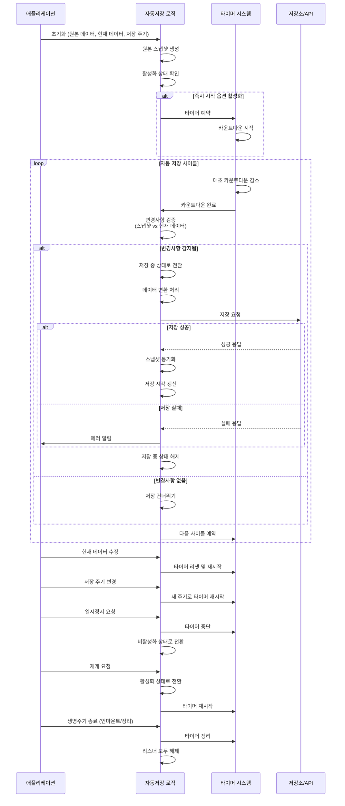

## 시퀀스 다이어그램

```mermaid
sequenceDiagram
    participant User as 애플리케이션
    participant Core as 자동저장 로직
    participant Timer as 타이머 시스템
    participant Storage as 저장소/API

    User->>Core: 초기화 (원본 데이터, 현재 데이터, 저장 주기)
    Core->>Core: 원본 스냅샷 생성
    Core->>Core: 활성화 상태 확인

    alt 즉시 시작 옵션 활성화
        Core->>Timer: 타이머 예약
        Timer->>Timer: 카운트다운 시작
    end

    loop 자동 저장 사이클
        Timer->>Timer: 매초 카운트다운 감소
        Timer->>Core: 카운트다운 완료
        Core->>Core: 변경사항 검증<br/>(스냅샷 vs 현재 데이터)

        alt 변경사항 감지됨
            Core->>Core: 저장 중 상태로 전환
            Core->>Core: 데이터 변환 처리
            Core->>Storage: 저장 요청

            alt 저장 성공
                Storage-->>Core: 성공 응답
                Core->>Core: 스냅샷 동기화
                Core->>Core: 저장 시각 갱신
            else 저장 실패
                Storage-->>Core: 실패 응답
                Core->>User: 에러 알림
            end

            Core->>Core: 저장 중 상태 해제
        else 변경사항 없음
            Core->>Core: 저장 건너뛰기
        end

        Core->>Timer: 다음 사이클 예약
    end

    User->>Core: 현재 데이터 수정
    Core->>Timer: 타이머 리셋 및 재시작

    User->>Core: 저장 주기 변경
    Core->>Timer: 새 주기로 타이머 재시작

    User->>Core: 일시정지 요청
    Core->>Timer: 타이머 중단
    Core->>Core: 비활성화 상태로 전환

    User->>Core: 재개 요청
    Core->>Core: 활성화 상태로 전환
    Core->>Timer: 타이머 재시작

    User->>Core: 생명주기 종료 (언마운트/정리)
    Core->>Timer: 타이머 정리
    Core->>Core: 리스너 모두 해제
```
